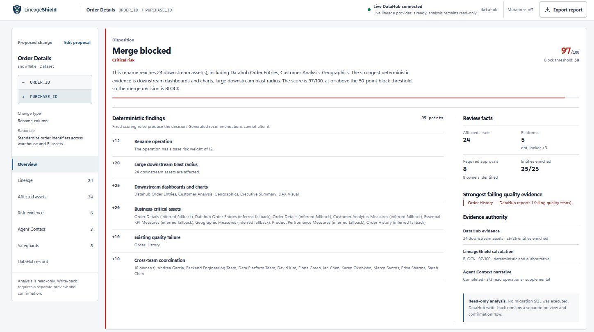

# LineageShield

[](https://github.com/Rahmat9009/LineageShield/actions/workflows/tests.yml)

**A live DataHub change-review agent that shows who and what a schema change can break before it is merged.**

**Challenge category:** DataHub Agent Hackathon



> Verified live DataHub example: `ORDER_ID` → `PURCHASE_ID`, **BLOCK**, **97/100**, and **24 affected assets**. [View the complete screenshot set](docs/screenshots/).

## 30-second judge overview

### Problem

A schema change that looks local in a pull request can silently break dbt models, scheduled pipelines, executive dashboards, and production features. Reviewers rarely have the complete dependency context at merge time. LineageShield brings that context into a single pre-merge investigation and explains every point in its decision.

### Workflow

1. Submit a column rename, drop, type change, or addition.
2. Query real downstream lineage from **DataHub OSS**, enrich every returned asset with available metadata, and run an independent read-only **Agent Context Kit** investigation.
3. Apply an explainable **deterministic risk score** and return `ALLOW`, `REVIEW`, or `BLOCK` with required owner approvals.
4. Generate review-only migration SQL, a compatibility layer, schema tests, rollback steps, and a pull-request summary.
5. Optionally preview and explicitly confirm an **idempotent, root-only DataHub write-back**. Analysis is read-only by default.

### Verified live result

The committed [Order Details rename capture](examples/order-details-rename/) is a real local API result, not demo data: **`BLOCK`, 97/100 (`CRITICAL`), 24 downstream assets across dbt, Looker, Power BI, Snowflake, and Tableau**. DataHub enriched 25/25 entities. Agent Context Kit executed three successful read operations, recorded 0 column-lineage references, and fell back visibly to 24 dataset-level references. No generated SQL was executed, and the captured write-back preview performed no mutation.

### Technologies

- DataHub OSS and `acryl-datahub` 1.6.0.6 for lineage and real metadata enrichment
- DataHub Agent Context Kit 1.6.0.17 for auditable `get_entities` and `get_lineage` tool execution
- A reusable, validated [DataHub Skill](skills/schema-change-impact-review/SKILL.md)
- Python 3.11, FastAPI, Pydantic, pytest, and build-free vanilla HTML/CSS/JavaScript
- Deterministic scoring and safeguards; **no paid LLM or model API key required**
- **51 passing tests**, isolated from live DataHub

### Quick demo links

- [Captured live example and generated artifacts](examples/order-details-rename/)
- [Architecture and trust boundaries](docs/architecture.md)
- [Judge setup, exact results, and troubleshooting](docs/judge-guide.md)
- [2:45 demo script](docs/demo-script.md)
- [Reusable schema-change-impact-review DataHub Skill](skills/schema-change-impact-review/SKILL.md)

### Installation

For the fastest offline UI evaluation:

```powershell
py -3.11 -m venv .venv
.\.venv\Scripts\Activate.ps1
python -m pip install -r requirements.txt
Copy-Item .env.example .env
python -m uvicorn app.main:app --host 127.0.0.1 --port 8000
```

For the primary live workflow, start DataHub OSS at `http://localhost:8080`, install `requirements-datahub.txt`, and copy `.env.live.example` instead. The complete path is in the [judge guide](docs/judge-guide.md#full-live-datahub-setup) and below.

## How DataHub is used

Live mode uses `DataHubClient.from_env()` to:

1. Request downstream column-level lineage for the submitted field.
2. Fall back to downstream entity-level lineage when fine-grained lineage is absent.
3. Traverse up to two hops, remove duplicate URNs, and normalize up to 60 affected assets.
4. Fetch typed entity aspects for the root and downstream datasets, dashboards, charts, data jobs, and supported ML entities in bounded batches.
5. Resolve referenced users, groups, ownership types, tags, and glossary terms to their DataHub display names while retaining the full URNs.
6. Return per-field provenance and a metadata coverage summary with the real provider evidence.
7. Run an independent, read-only Agent Context Kit workflow for root entity context and downstream lineage, with a visible column-to-dataset fallback trace.

Direct metadata can include display name, platform, description, schema fields, owners, tags, glossary terms, structured properties, and identifiable quality test results. Every asset marks values as `datahub`, `lineage`, `inferred`, `fallback`, `unavailable`, or `demo`; inferred criticality is never represented as stored DataHub metadata.

Normal analysis remains read-only. An optional, disabled-by-default write-back flow can record a reviewed result on the root dataset only after a separate preview and explicit confirmation. LineageShield never creates pull requests or executes generated SQL.

## Architecture

See [the full Mermaid architecture and authority boundaries](docs/architecture.md).

```text
Browser (vanilla HTML/CSS/JS)
        │
        ▼
FastAPI routes
  ├── /api/analyze ──► ChangeImpactService
  │                       ├── ContextProvider
  │                       │     ├── DataHubContextProvider (live)
  │                       │     └── DemoContextProvider (offline fallback)
  │                       ├── AgentContextService
  │                       │     └── DataHubContext + read-only MCP tools
  │                       ├── RiskEngine (deterministic)
  │                       └── ArtifactGenerator (review templates)
  │                              │
  │                              └──► AnalysisStore (bounded snapshot)
  └── /api/writeback/* ──► AnalysisStore ──► DataHubWritebackService
                                                 └── description JSON Patch
```

The frontend has no build step or paid visualization dependency. Its SVG lineage view is generated only from API-returned assets and edges, with the affected-assets explorer as the accessible list alternative.

## Local setup on Windows

Prerequisites:

- Python 3.11
- A local DataHub quickstart already running at `http://localhost:8080`
- A DataHub token only if your local instance requires one

Create the environment and install the live provider:

```powershell
cd lineageshield-starter
py -3.11 -m venv .venv
Set-ExecutionPolicy -Scope Process -ExecutionPolicy Bypass
.\.venv\Scripts\Activate.ps1
python -m pip install --upgrade pip
python -m pip install -r requirements-datahub.txt
```

Create the local configuration:

```powershell
Copy-Item .env.live.example .env
```

The live configuration is:

```env
APP_NAME=LineageShield
CONTEXT_PROVIDER=datahub
DATAHUB_GMS_URL=http://localhost:8080
DATAHUB_GMS_TOKEN=
DATAHUB_MUTATIONS_ENABLED=false
DATAHUB_MUTATION_TIMEOUT_SECONDS=12
ANALYSIS_STORE_TTL_SECONDS=1800
ANALYSIS_STORE_MAX_ENTRIES=100
DATAHUB_HEALTH_TIMEOUT_SECONDS=6
DATAHUB_LINEAGE_TIMEOUT_SECONDS=30
DATAHUB_ENRICHMENT_TIMEOUT_SECONDS=20
DATAHUB_ENRICHMENT_REQUEST_TIMEOUT_SECONDS=6
DATAHUB_ENRICHMENT_CONCURRENCY=4
DATAHUB_ENRICHMENT_BATCH_SIZE=50
AGENT_CONTEXT_TIMEOUT_SECONDS=24
AGENT_CONTEXT_TOOL_TIMEOUT_SECONDS=10
AGENT_CONTEXT_MAX_LINEAGE_RESULTS=60
```

Do not commit `.env` or print a real token. Start LineageShield:

```powershell
python -m uvicorn app.main:app --reload --host 127.0.0.1 --port 8000
```

Open `http://127.0.0.1:8000`.

## Sample hackathon scenario

Use **Sample scenario** in the proposal panel. It loads the live showcase asset:

```text
urn:li:dataset:(urn:li:dataPlatform:snowflake,b2fd91.order_entry_db.analytics.order_details,PROD)
```

The proposal renames `ORDER_ID` to `PURCHASE_ID`. With the local showcase metadata loaded, DataHub returns the real downstream blast radius (approximately 24 assets in the current environment). The exact count can change with the metadata in DataHub; LineageShield never hardcodes it.

Demo flow for judges:

1. Confirm the header says **Live DataHub connected** and provider `datahub`.
2. Load the sample and run the investigation.
3. Read the merge decision and four summary metrics first.
4. Select nodes in the SVG graph and filter the dependency explorer.
5. Open **Agent investigation** and show the actual read-tool trace and recorded lineage fallback.
6. Expand the deterministic risk evidence and show the score composition.
7. Review Migration, Compatibility, Tests, Rollback, and PR Summary.
8. Export the complete JSON report, including `agent_trace`.
9. Open **Record in DataHub**, preview the exact patch, and show that Apply is disabled by default.

## Current capabilities

- Live DataHub connection and retryable failure state
- Column-level downstream lineage with entity-level fallback
- De-duplication and typed entity enrichment for the root and downstream assets
- Resolved DataHub display names for users, groups, ownership roles, tags, and glossary terms, with original URNs retained in the API
- Real dataset schema fields, descriptions, structured properties, and platform metadata when present
- Real owner values used for required approvals on high- and critical-impact assets
- Quality status only when DataHub test results contain an identifiable quality or assertion signal; otherwise `unknown`
- Per-field metadata provenance and aggregate enrichment coverage in every analysis response
- Explicit DataHub criticality from exact structured/custom properties when available; deterministic inferred criticality otherwise
- Interactive SVG blast-radius view using real API results
- Search and filters for asset type, platform, and criticality
- Keyboard-accessible node inspection, tabs, controls, and visible focus
- Deterministic risk factors with visible point contributions and evidence
- Explicit thresholds:
  - `0–24`: `ALLOW`
  - `25–49`: `REVIEW`
  - `50–74`: `BLOCK` / high risk
  - `75–100`: `BLOCK` / critical risk
- Generated migration SQL, compatibility SQL, schema tests, rollback steps, and PR summary
- Copy actions, individual artifact downloads, and full JSON export
- Structured provider health and analysis errors without browser alerts
- A two-step, root-only DataHub write-back with an exact preview, explicit confirmation, read-back receipt, and idempotent repeat behavior
- Agent Context Kit 1.6.0.17 execution during every normal live investigation, with sanitized tool audit data and no paid model dependency
- A reusable, validated `schema-change-impact-review` skill under `skills/`, submitted upstream in [DataHub Skills PR #87](https://github.com/datahub-project/datahub-skills/pull/87)

## What makes this an agent

LineageShield does more than display a lineage query:

- **Actual tool execution:** in live mode it invokes Agent Context Kit's `get_entities` and `get_lineage` operations through `DataHubContext`, in addition to the authoritative provider retrieval.
- **Traceability:** every operation records a sanitized status, duration, count summary, and evidence URNs in `agent_trace`; raw tool payloads, descriptions, prompts, tokens, and secret-bearing errors are not retained.
- **Evidence-aware fallback:** it attempts column lineage first and deliberately executes dataset lineage when fine-grained evidence is empty or unusable. The fallback and reason remain visible.
- **Deterministic action:** it turns the retrieved graph into a reproducible score, decision, approval list, explanation, and migration safeguards. The narrative cannot override any of them.
- **Controlled write-back:** after a separate preview, the agent can record the stored review on the root DataHub asset only when mutations are enabled and a human supplies the exact confirmation. Repeating the same record is idempotent.

## Truthfulness and safety

- Live results come from DataHub; the bundled demo provider is labeled and never presented as live evidence.
- Missing owners, usage, quality, tags, schema fields, or terms remain empty, `unknown`, or `unavailable` instead of being fabricated.
- Only exact DataHub `criticality` properties are explicit. The deterministic asset/platform/hop rule is always labeled `inferred`.
- Usage remains 0 and `unavailable` until the connected SDK exposes a defensible normalized score; raw query counts are not converted onto an invented scale.
- Provider evidence and deterministic services are authoritative. The Agent Context narrative is a bounded evidence summary, uses no paid LLM, and cannot change risk or mutation behavior.
- Analysis and preview are read-only. Generated SQL is never executed. Write-back is disabled by default, snapshot-backed, root-only, explicitly confirmed, verified, and isolated from downstream assets.
- The committed [live example](examples/order-details-rename/) preserves the API values and explicitly reports that executable rollback SQL was not returned.

## Agent Context Kit integration

LineageShield uses the Agent Context Kit because it provides DataHub-aware context operations that are directly auditable during an agentic investigation. It does not delegate correctness to an LLM. The deterministic provider, risk engine, thresholds, approvals, safeguard templates, write-back confirmation, and mutation adapter remain authoritative.

The installed and pinned package is `datahub-agent-context==1.6.0.17`. The application uses these exact public interfaces:

```python
from datahub_agent_context.context import DataHubContext
from datahub_agent_context.mcp_tools.entities import get_entities
from datahub_agent_context.mcp_tools.lineage import get_lineage
```

For each live analysis, `AgentContextService` uses the same `DataHubClient.from_env()` client and performs:

1. `get_entities(urns=[root_urn])`
2. `get_lineage(urn=root_urn, column=column, upstream=False, max_hops=2, max_results=60)`
3. `get_lineage(..., column=None, ...)` only when column lineage is empty or unusable

The default path is deterministic and read-only. It never asks for an OpenAI, Anthropic, Google, or other paid model key, and `llm_used` is always `false`. There is currently no optional LLM integration. The narrative is a fixed evidence summary and cannot override the score or decision.

Every `AnalysisResult` contains an `agent_trace` with:

- `status`: `completed`, `degraded`, or `unavailable`
- kit version, deterministic read-only mode, and total duration
- requested and successful operation IDs
- per-tool status, safe result summary, duration, and evidence URNs
- sanitized failure types and messages without raw responses
- whether fallback occurred and why
- evidence references and deterministic narrative provenance

If the package, client, or a tool is unavailable, LineageShield returns that degraded state honestly and continues only when the deterministic provider already supplied usable context. Agent output never creates lineage, owners, quality, usage, approvals, risk points, or mutation outcomes.

The reusable DataHub skill is [skills/schema-change-impact-review/SKILL.md](skills/schema-change-impact-review/SKILL.md). It follows the current DataHub Skills layout with self-contained examples and risk/safety references. It has been validated locally and submitted upstream in [DataHub Skills PR #87](https://github.com/datahub-project/datahub-skills/pull/87), where it is awaiting maintainer review.

## Safe DataHub write-back

Write-back uses one JSON Patch operation on the reviewed root dataset's `editableDatasetProperties.description` field. LineageShield first reads the effective description, preserves it byte-for-byte, and appends or replaces only the matching, clearly delimited block:

```text
<!-- LINEAGESHIELD:BEGIN <analysis-id> -->
...
<!-- LINEAGESHIELD:END <analysis-id> -->
```

The block records the analysis ID and UTC analysis timestamp, proposed change and affected column, optional new value, merge decision, deterministic risk score and level, affected asset count, real required-approval labels, concise evidence, migration and rollback summaries, and an explicit statement that no migration was executed. It does not change downstream assets, owners, tags, terms, quality signals, structured properties, or warehouse data.

The workflow is deliberately two-step:

1. `POST /api/writeback/preview` accepts only a completed `analysis_id`, reads the current description, and returns the exact managed section and complete resulting description. It never mutates DataHub and works while mutations are disabled.
2. `POST /api/writeback/apply` accepts the same `analysis_id` plus the exact confirmation value `RECORD_IN_DATAHUB`. It rejects disabled mode, missing confirmation, and unknown or expired analyses. All decision data comes from the server-side snapshot, never browser-supplied scores or decisions.

To enable Apply for a deliberate test, change only the local process configuration and restart:

```powershell
$env:DATAHUB_MUTATIONS_ENABLED = "true"
python -m uvicorn app.main:app --host 127.0.0.1 --port 8000
```

Stop that process and remove the temporary session variable to return to the safe default:

```powershell
Remove-Item Env:DATAHUB_MUTATIONS_ENABLED
```

Do not set the tracked example files to `true`, and do not commit `.env`. Repeating Apply for the same analysis re-reads DataHub and returns `already_applied` without sending another patch when the managed section already matches.

To remove a test record, open the root asset's Documentation editor in DataHub, delete the exact block from its `LINEAGESHIELD:BEGIN <analysis-id>` marker through its matching `END` marker, and save without changing the surrounding text. To replace it, remove that block and apply a newly completed investigation. If your DataHub version offers a **Revert edit** action and the asset originally used ingestion-owned documentation, use that action only when you intend to remove the entire editable description override.

## Enrichment performance and resilience

The installed DataHub v2 `EntityClient` exposes single-entity `get()` calls. To avoid a serial call per asset, LineageShield uses the SDK's typed OpenAPI `DataHubGraph.get_entities()` batch surface through the client, grouped by entity type and split into batches of 50. The public single-entity client remains a bounded fallback when the bulk surface is unavailable.

- At most four metadata requests run concurrently by default.
- Each metadata request has a six-second application deadline.
- The complete enrichment stage has a 20-second deadline.
- Immediate batch failures are split to isolate the bad record; a timed-out batch is not retried one entity at a time.
- Missing or failed metadata preserves the lineage result and safe URN fallback instead of failing the investigation.
- No URNs, access tokens, or response bodies are written to failure logs.

These values can be tuned with the `DATAHUB_ENRICHMENT_*` environment settings shown above. The lineage limit remains 60 downstream assets.

Agent Context execution has a separate 10-second deadline per tool and 24-second total budget by default. Calls run in worker threads so the FastAPI event loop remains responsive. An application timeout stops awaiting a synchronous SDK call but cannot terminate its worker thread. The trace reports the timeout and deterministic analysis continues when possible. Use the `AGENT_CONTEXT_*` settings above to tune the bounded read path.

## Offline demo provider

For UI development when DataHub is intentionally unavailable, set:

```env
CONTEXT_PROVIDER=demo
```

This uses `app/data/demo_graph.json`. Demo metadata is a fallback only; the primary hackathon workflow is the live DataHub provider.

## API

Health and provider status:

```http
GET /api/health
```

Analyze a proposed change:

```http
POST /api/analyze
Content-Type: application/json
```

```json
{
  "asset_urn": "urn:li:dataset:(urn:li:dataPlatform:snowflake,b2fd91.order_entry_db.analytics.order_details,PROD)",
  "column": "ORDER_ID",
  "change_type": "rename",
  "new_value": "PURCHASE_ID",
  "reason": "Standardize order identifiers across warehouse and BI assets"
}
```

Existing endpoints remain available, including `GET /api/demo-context`.

Preview a stored completed analysis without mutating:

```http
POST /api/writeback/preview
Content-Type: application/json

{"analysis_id": "<analysis-id>"}
```

Apply the server-stored record after explicit confirmation:

```http
POST /api/writeback/apply
Content-Type: application/json

{"analysis_id": "<analysis-id>", "confirmation": "RECORD_IN_DATAHUB"}
```

## Testing

Automated tests use mocked or bundled providers and do not require DataHub:

```powershell
python -m pytest -q
```

The suite covers risk thresholds, a large downstream blast radius, lineage fallback and duplicate removal, root and downstream enrichment, reference normalization and deduplication, partial failures and timeouts, metadata provenance, approval owners, readable URN fallbacks, analysis-store bounds and expiry, preview/apply safety, tamper rejection, description preservation, idempotency, Agent Context execution and failure isolation, authoritative scoring, no-key/no-mutation guarantees, JSON trace export, skill safety content, and mocked FastAPI endpoints. It does not require a running DataHub server.

Run the Agent Context integration tests and skill validator directly:

```powershell
python -m pytest tests/test_agent_context.py -q
python "$env:USERPROFILE\.codex\skills\.system\skill-creator\scripts\quick_validate.py" skills\schema-change-impact-review
```

Import check:

```powershell
python -c "import app.main; print('LineageShield import OK')"
```

## Current limitations

- Live traversal is limited to two hops and 60 normalized downstream assets.
- DataHub lineage results are represented with the explicit edges available to the provider; the current live normalization connects returned dependents to the source when intermediate path edges are unavailable.
- Usage stays at `0` with provenance `unavailable`. The installed SDK exposes raw dataset usage timeseries rather than a canonical, defensible `0–100` popularity score, and the connected sample returned no usage records during capability inspection. LineageShield does not invent a normalization.
- DataHub Cloud's assertions client is not installed in the local open-source environment (`acryl-datahub-cloud` is required). Quality therefore uses only identifiable quality/assertion entries already present in DataHub's `testResults` aspect; all other assets remain `unknown`.
- DataHub has no universal criticality field in the retrieved aspects. Exact `criticality` structured/custom property values are treated as explicit; otherwise the existing deterministic asset-type/platform/hop inference is retained and labeled `inferred`.
- Reference names depend on the typed bulk OpenAPI endpoint. If a referenced user, group, ownership type, tag, or term cannot be resolved, the API keeps its full URN and supplies a readable URN fallback label.
- The installed DataHub v2 SDK reports its entity API as experimental. LineageShield isolates SDK failures and falls back safely, but future SDK upgrades should be regression-tested.
- The installed Agent Context Kit's package namespace eagerly imports its complete MCP tool module, including mutation helpers, and emits an experimental SDK warning in this environment. LineageShield's adapter exposes and invokes only `get_entities` and `get_lineage`; normal analysis still performs zero mutations.
- On the current local OSS sample, Agent Context Kit column-level lineage returns zero results while its dataset-level lineage returns 24. The trace records this expected fallback instead of claiming fine-grained evidence.
- Agent Context calls duplicate a small amount of provider retrieval to prove real toolkit execution. This adds bounded latency but keeps provider validation and deterministic scoring independent.
- The deterministic agent narrative summarizes relationships at investigation time; there is no model-generated reasoning or optional LLM configuration yet.
- Application timeouts stop waiting for synchronous SDK work; Python cannot forcibly terminate an already-running `to_thread` HTTP call, which may finish in the background.
- Completed-analysis storage is process-local, capped at 100 entries, and expires records after 30 minutes by default. It is lost on restart and is not suitable for multiple workers, durable audit, or production coordination.
- Preview and Apply each read the current effective description. Applying creates or updates DataHub's editable description layer; on assets whose visible description came only from ingestion, this can intentionally shadow later ingestion-owned description updates until the editable override is reverted.
- The installed `acryl-datahub` client is `1.6.0.6`; the verified local server is `v1.5.0.6` and advertises patch support. This SDK has no description-specific public patch builder, so the mutation adapter uses its generic `MetadataPatchProposal` scalar patch surface and is covered by a shape test. Regression-test this adapter on SDK upgrades.
- A timeout or transport error after patch submission has an honestly reported `unknown` mutation state. Inspect the root asset before retrying. The single-aspect design avoids multi-operation partial success but cannot prove whether an interrupted remote request committed.
- Generated safeguards are review templates. LineageShield does not execute SQL or write to GitHub.
- No authentication, billing, GitHub PR creation, downstream mutation, or multi-user durable state is included.

## Repository map

```text
app/
  context/       DataHub and demo context providers
  services/      Risk scoring, Agent Context orchestration, artifacts, analysis store, write-back
  static/        Enterprise review console and SVG lineage renderer
  data/          Bundled offline demo graph
skills/          Reusable schema-change-impact-review DataHub Skill
tests/           Unit and FastAPI tests
```

LineageShield is licensed under Apache 2.0.
