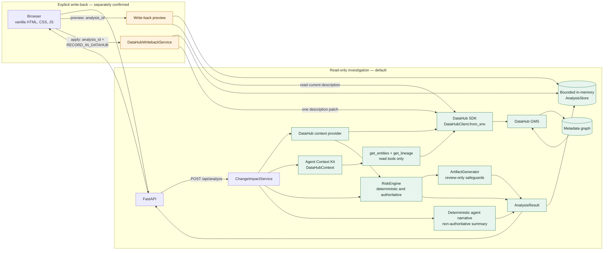

# LineageShield architecture

LineageShield separates live evidence retrieval, deterministic policy, generated narrative, and the one explicit mutation path. Solid arrows below are request/data flow; the two subgraphs mark the safety boundary.

## Authority and provenance

The DataHub provider is authoritative for the normalized metadata graph: lineage, entities, owners, schema fields, tags, glossary terms, structured properties, and identifiable quality results. Values carry field-level provenance. Missing values remain empty, `unknown`, or `unavailable`; only exact DataHub `criticality` properties are explicit, while the asset/platform/hop rule is labeled `inferred`.

`RiskEngine` is authoritative for points, thresholds, risk level, decision, and the owner-derived approval list. `ArtifactGenerator` creates review templates but cannot change risk. Agent Context Kit independently executes `get_entities` and `get_lineage`; its sanitized trace proves the read operations and fallback path. Its deterministic narrative is explanatory, not authoritative, and `llm_used` remains false.

## Read and write boundaries

Analysis and preview are always read-only. Column-level downstream lineage is attempted first, followed by an honestly recorded dataset-level fallback when needed. Both provider enrichment and Agent Context calls are bounded by time and result limits.

A completed result is copied into the bounded in-memory `AnalysisStore`. Preview accepts only its `analysis_id`, re-reads the root documentation, and returns the exact proposed description without patching. Apply is a separate route that additionally requires `RECORD_IN_DATAHUB` and `DATAHUB_MUTATIONS_ENABLED=true`. It uses the stored snapshot, patches only the reviewed root dataset's `editableDatasetProperties.description`, preserves surrounding documentation, verifies the result, and treats an identical repeat as already applied. Downstream assets and warehouse data are never mutated.

